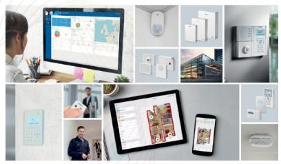
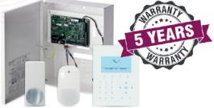
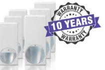

## SPC & Magic PDM inbrottslarm

## De bästa funktionerna med utökad garanti

Vi är stolta över att vara kundens första och framtida val på acre security. Denna garantiförlängning* visar vår tro på att sätta våra kunders behov först. Du kan vara trygg när du köper acre security's produkter. Välj acre security och du kommer känna att du valt rätt när det gäller förstklassiga och presterande produkter.

Flexibelt system med förtklassiga detektorer, både trådanslutna och trådlöst, samt möjlighet till kortläsare.

MAGIC IR-detektorer finns med täckningsavstånd på både 12 och 18m, med och utan antimask.

Scanna QR-koden för snabb översikt och how-to videos

## SPC skyddar företagsfastigheter och tillgångar

Det är ett inbrottslarm som erbjuder mångsidig och omfattande larmhanteringsfunktioner. Genom användning av molntjänster, slutanvändarappar och dedikerad programvara igger SPC i framkant av modernt inbrottslarm. SPC-produktgarantier ökar från 3 till 5 år, vilket säkerställer att SPC alltid är ett säkert val.

## Förbättrad Detektionsteknik

Vårt breda utbud av imponerande PDM-detektorer drar nytta av den innovativa MAGIC spegel-teknologin som maximerar detekteringen men ändå är hälften så djupa som alla andra premiumdetektorer, de har även fått en platt front. Garantin på dessa detektorer är nu utökad till 10 år, vilket stöder vår produktkvalitet och pålitlighet.

*Garantiförlängningar gäller för nya produkter köpta efter 1 januari 2021

acresecurity.com

