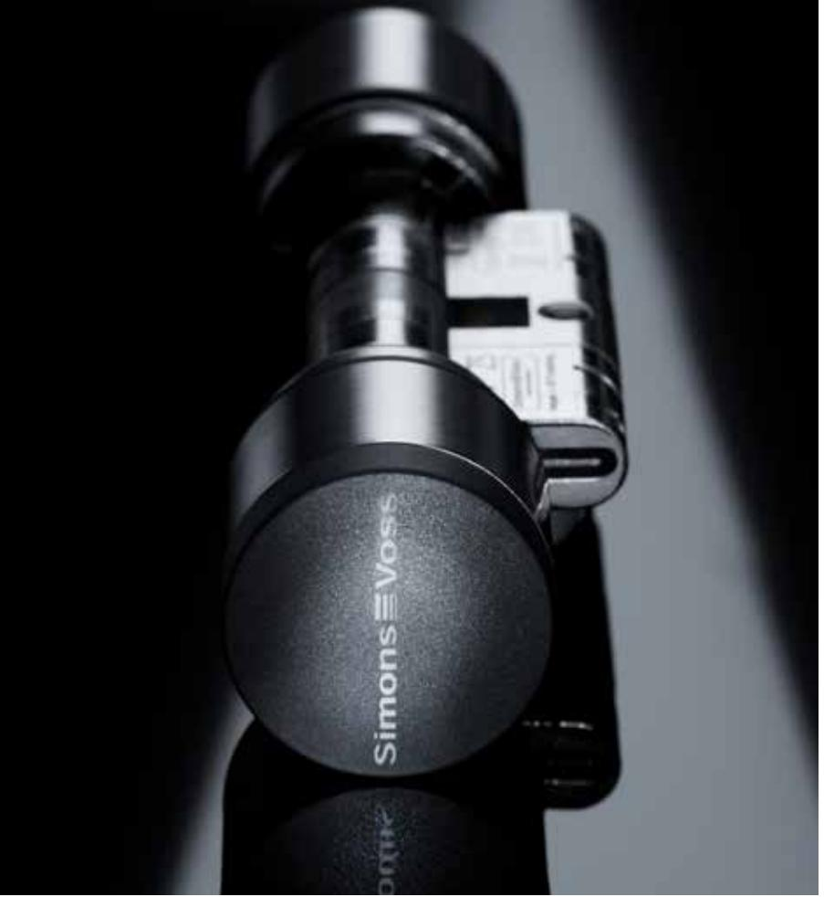
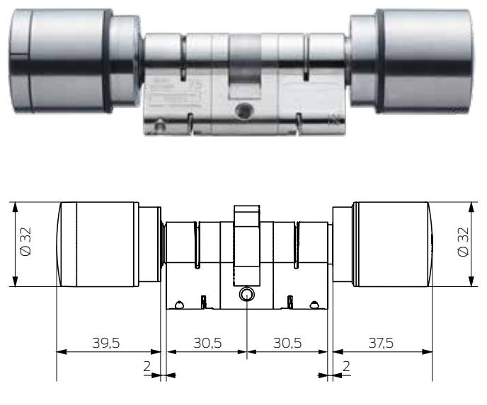
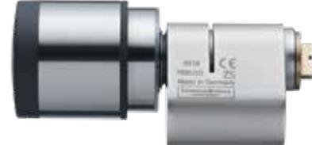
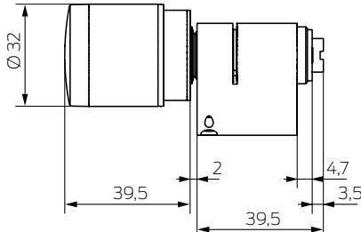

### // **TEKNISKA DATA**

# // **EGENSKAPER**

- **::** Högsta datasäkerhet: Secure Element lagrar den krypterade systeminformationen och är en del av den nya AX-säkerhetsarkitekturen. Det här speciella chipet är en integrerad del av autentiseringen och kan inte läsas av från utsidan.
- **::** Borrskyddet skyddar aktuatorelektroniken och cylinderprofilen (Europaprofil) mot externa angrepp. Angreppsbeständighet genom det integrerade borrskyddet bevisad: Högsta klassificeringsnyckel 2 enligt standarden DIN EN 15684.
- **::** Aktiv, passiv eller hybrid olika läsvarianter är alltid möjliga och stöds av tekniken Bluetooth Low Energy (BLE).
- **::** Flexibel tack vare modulär konstruktion: Cylinder AX kan snabbt och effektivt anpassas till alla dörrtjocklekar tack vare individuellt justerbara cylinderlängder.
- **::** Ovanligt lång batterilivslängd (upp till 12 års standby).
- **::** En säker investering är en del av SimonsVoss löfte. Cylinder AX kan integreras i befintliga system (bakåtkompatibel med befintliga komponenter).
- **::** Snyggt utseende: Cylinder AX imponerar inte bara genom sitt utseende utan även genom bekväm haptik med ergonomiska knappar.
- **::** Ännu bekvämare användning genom optiska och akustiska svarssignaler.
- **::** Made in Germany. En självklarhet för oss.

| Profiler   | :: Europrofilcylinder (EU) :: Scandinavian Oval-cylinder (SO)                                                                                     | Batterilivslängd                                            | Upp till 12 års standby eller 100 000 manövreringar (standard)/                                                                                                            |
|------------|------------------------------------------------------------------------------------------------------------------------------------------------------|-------------------------------------------------------------|-------------------------------------------------------------------------------------------------------------------------------------------------------------------------------|
| Grundlängd | från 30–30mm (EU) Kort cylinder 25–25 mm (EU) resp. 30mm (SO)                                                                                  |                                                             | 300 000 manövreringar (batteriknopp)                                                                                                                                          |
|            |                                                                                                                                                      | Temperaturområde                                            | Drift: -25 °C till +65 °C (enligt DIN EN 15684)                                                                                                                            |
|            | Kan beställas och förlängas i steg om 5 mm upp till en längd av 90 mm per sida (EU); övriga längder på begäran                                 | Skyddsklass                                                 | IP54 (standard) / IP67 (alternativ .WP)                                                                                                                                       |
|            |                                                                                                                                                      | Signalering                                                 | Akustisk (summer) och/eller Visuell (LED – grön/röd)                                                                                                                       |
| Knoppar    | Läsknopp: :: Aktiv cylinder: Ringlock i rostfritt stål; Tillbehör: Knopplock i rostfritt stål :: Passiv-/hybridcylinder: Svart plastlock | Offline-lagringsbara tillträden (alternativ .ZK)      | Upp till 3 000                                                                                                                                                                |
|            |                                                                                                                                                      | Tidszonsgrupper                                             | 100+1                                                                                                                                                                         |
|            |                                                                                                                                                      | Antal medier per cylinder Trådlöst nätverk 868 MHz | Upp till 64 000                                                                                                                                                               |
|            | Vridknopp: Rostfritt stål                                                                                                                            |                                                             |                                                                                                                                                                               |
|            | Diameter: 32mm                                                                                                                                       |                                                             | Nätverksförberedd med integrerad                                                                                                                                              |
| Läsmetod   | :: Aktiv transponderteknik 25 KHz :: Passiv (MIFARE® Classic och DESFire®) :: Hybrid (aktiv och passiv) :: Bluetooth Low Energy (BLE)       |                                                             | LockNode (kan eftermonteras)                                                                                                                                                  |
|            |                                                                                                                                                      | Uppgradering                                                | Fast programvara kan uppgraderas via BLE                                                                                                                                      |
|            |                                                                                                                                                      | Certifikat                                                  | :: DIN EN 15684: Klassificering 16B4AF32 (Standard/VdS) :: DIN 18252: Klassificeringsnyckel EE6DFZG (standard) / EE6DR1 (antipanik) :: VdS-klass BZ: Ansökt |
| Drifttyper | Offline, virtuellt nätverk och online (kan kombineras)                                                                                            |                                                             |                                                                                                                                                                               |
| Batterityp | CR 2450, 3 V litium                                                                                                                                  |                                                             |                                                                                                                                                                               |
|            | Antal: 2× (standard)/ 6× (batteriknopp)                                                                                                           |                                                             |                                                                                                                                                                               |

- **::** SKG förbereds

# // **PRODUKTVARIANTER**

| DIGITALA EUROPROFILCYLINDRAR AX                                                                                                                                                                                                                   |                        |
|---------------------------------------------------------------------------------------------------------------------------------------------------------------------------------------------------------------------------------------------------|------------------------|
| Digital dubbelknoppcylinder Europaprofil AX – Comfort, Insida fast inkopplad, längd 30–30 mm, längdinställbar, demonterbara knoppar i rostfritt stål, integrerat borrskydd, kan användas med SimonsVoss-transponder                         | SV-Z5.EU.CO.30-30.A.G2 |
| Digital dubbelknoppcylinder Europaprofil AX – Friroterande, friroterande och avläsande på båda sidor, längd 30-30 mm, längdinställbar, demonterbara knoppar i rostfritt stål, integrerat borrskydd, kan användas med SimonsVoss-transponder | SV-Z5.EU.FD.30-30.A.G2 |
| Digital halvcylinder Europaprofil AX Längd 30-10 mm, längdinställbar, demonterbar knopp i rostfritt stål, integrerat borrskydd, kan användas med SimonsVoss-transponder                                                                     | SV-Z5.EU.HZ.30-10.A.G2 |
| DIGITAL SCANDINAVIAN OVAL-CYLINDER AX                                                                                                                                                                                                             |                        |
| Digital Scandinavian Oval-cylinder AX, för utsidan, längd 30 mm, demonterbar knopp i rostfritt stål, integrerat borrskydd, kan användas med SimonsVoss-transponder                                                                          | SV-Z5.SO.HZ.A30.A.G2   |
| LÄSMETOD SOM TILLVAL: :: Passiv (MIFARE® Classic och DESFire®) (M) :: Hybrid (aktiv och passiv) (AM)                                                                                                                                        | .M.G2 .AM.G2        |

### // **MÅTT**(EUROPROFIL/EU) // **MÅTT**(SCANDINAVIAN OVAL/SO)

Fler varianter, alternativ och tillbehör finns i prislistan.

