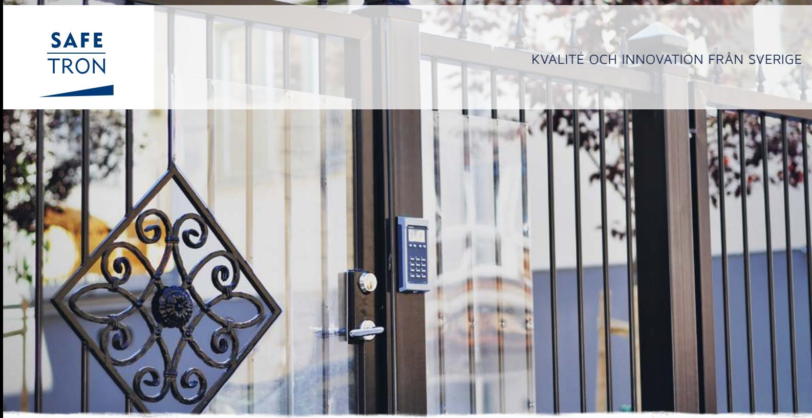
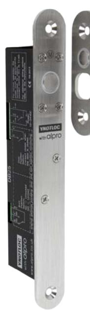
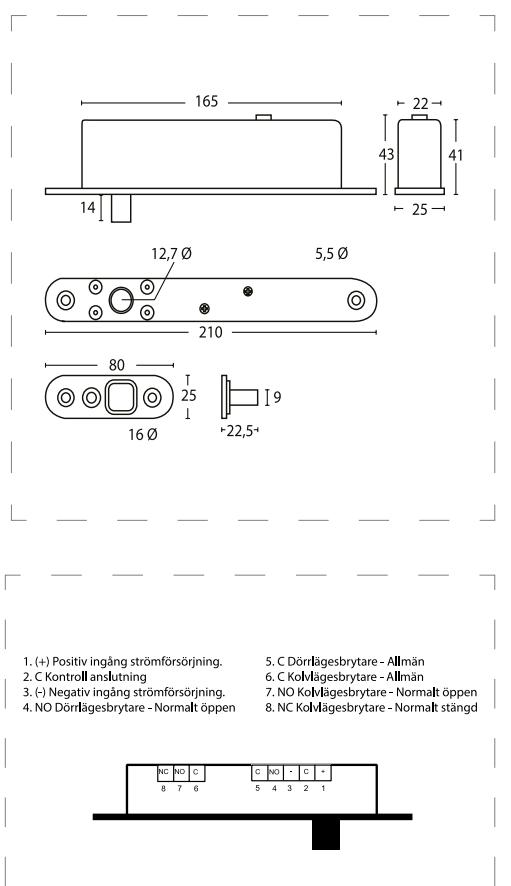

## S P E C I A L L Å S DB 25

# Kraftfullt infällt solenoidlås

DB 25 är konstruerad för att ge dold låsning med hög säkerhet för alla enkel- och dubbeldörrar. Lämplig för såväl sväng- som skjutdörrar.

Typiska användningsområden är personalslussar, mörkrum och liknande.

Förregling inträffar först när solenoidlåset och slutblecket befinner sig i stängt läge genom magnetavkänning.

#### Hög hållkraft

DB 25 har mekanisk förregling vilket bidrar till hög hållkraft, upp till 1000 kg.

#### Omvänd funktion

DB 25 levereras i omvänd funktion därför frånreglas låskolven automatiskt vid strömbortfall vilket eliminererar risken för innelåsning.

#### Multispänning

DB 25 kan drivas både på 12 VDC och 24 VDC

### S P E C I A L L Å S DB 25

#### EGENSKAPER

- Infälld montage
- Vertikal eller horisontell montering
- Kolv- och dörrlägesindikering
- Omvänd funktion

#### TEKNISKA DATA

- Multispänning 12/24 VDC +/- 15%
- Strömförbrukning:
- 12 VDC: 184 mA, 1330 mA vid aktivering
- 24 VDC: 98 mA, 1060 mA vid aktivering
- Hållkraft upp till 1000 kg
- Arbetstemperatur -10°C till +45°C

#### BENÄMNING ART NR

DB 25 solenoidlås 202 144 489

# Rätt till ändringar av katalogens innehåll och sortiment förbehålls. Vi reserverar oss för eventuella tryckfel. SAFETRON™ är ett registrerat varumärke.

#### **SAFETRON AB**

Säterivägen 18 P.O. Box 2096 65002 Karlstad Sweden

Tel: +46 54 19 02 45 Email: info@safetron.com

Du hittar alltid det senaste på safetron.com