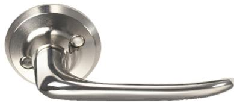

## **TRYCKE ASSA 6696 40-75 MM YD PRION PP**

22020395

**ASSA ABLOY** | Dörrtrycke Assa 6696 med genomgående fastsättning och returfjäder som avlastar låshusets roddarfjäder och hjälper trycket att förbli i horisontalläge. Rosett Ø 52 mm. Passar till Connect/Classic modul låshus. Skruv ingår.

BVB Undviks 1

## **Specifikation**

| Varumärke:      | ASSA ABLOY |
|-----------------|------------|
| Ytbeh/Färg:     | Prion      |
| Material:       | Mässing    |
| Längd:          | 106        |
| Dörrtjocklek:   | 40-75      |
| Skruvdimension: | M5         |
| Utsprång:       | 55         |