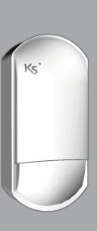
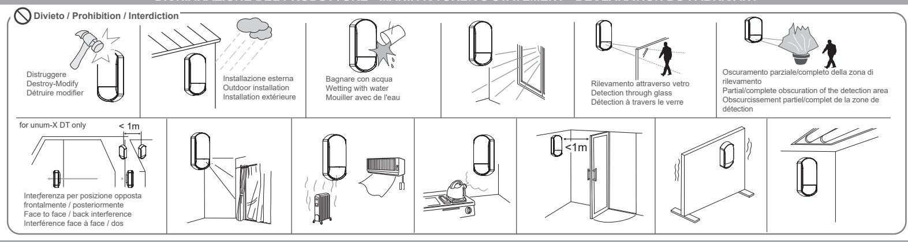
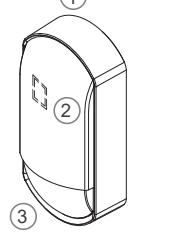
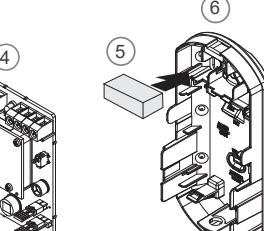
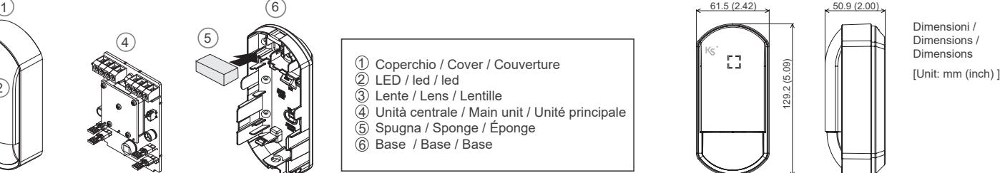
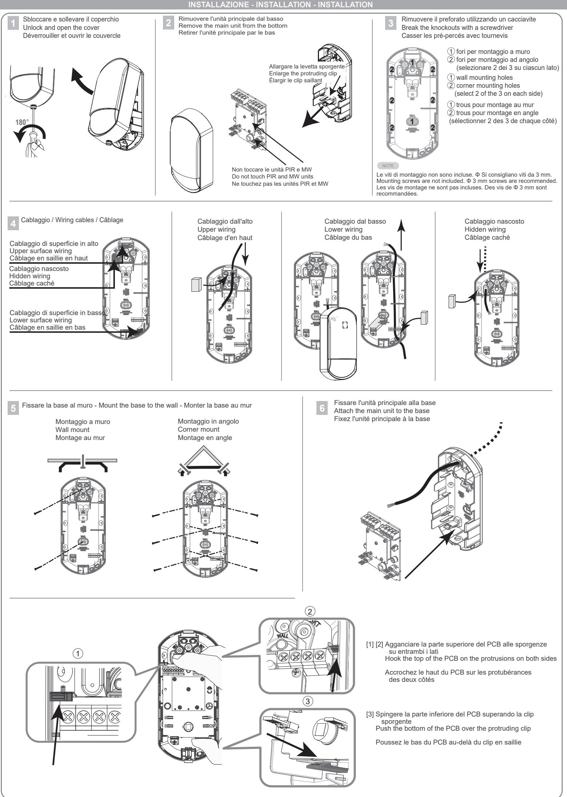
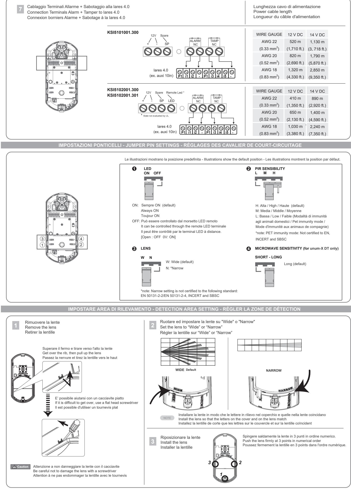
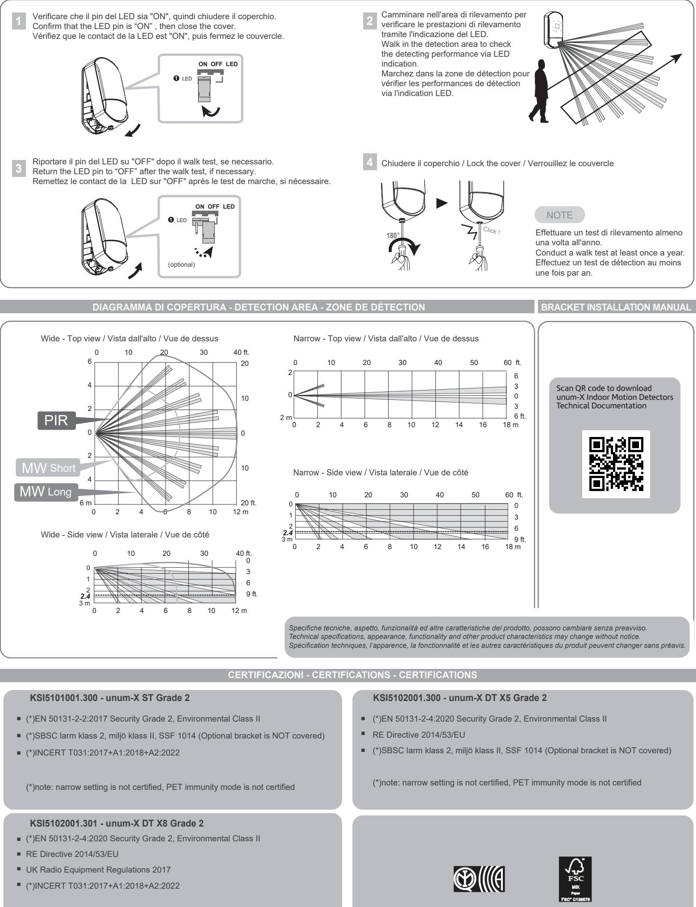

## **unum-X ST - DT universal**

**KSI5101001.300 unum-X ST - Grade 2 KSI5102001.300 unum-X DT X5 - Grade 2 KSI5102001.301 unum-X DT X8 - Grade 2**

Rilevatore di movimento per interni (filare) Indoor Motion detector (wired) Detecteur de mouvement intérieur (filaire)

Guida installazione Installation guide Guide d'installation

## **INTRODUZIONE - INTRODUCTION - INTRODUCTION**

 I rilevatori di movimento universali **unum-X ST** con rilevamento PIR e **unum-X DT X5/X8** a doppia tecnologia PIR e a microonde, sono rilevatori professionali che garantiscono il più alto grado di affidabilità, senza incorrere in falsi allarmi; implementano la tecnologia *Tough Mod2 TM*, in oro placcato, che offre una resistenza maggiore al caldo e all'umidità e prolunga la durata del rilevatore. La lente di tipo sferico è ruotabile di 180° dando la possibilità di ottenere un'area di rilevamento di tipo stretto ("narrow") per proteggere pareti, finestre, corridoi, ecc., contrapposto all'area di rilevamento, di base, di tipo ampio ("wide"). Si collega alla lares 4.0 utilizzando un qualunque morsetto di ingresso delle periferiche di espansione.

**unum-X ST** universal indoor motion detectors with PIR and **unum-X DT X5/X8** dual technology with PIR and microwave detection, are professional detectors that guarantee the highest degree of reliability, without incurring any false alarms; they implement *Tough Mod2 TM* technology, in gold plated, which offers high resistance to heat and humidity and extends the life of the detector. The spherical lens can be rotated 180° degrees to obtain a narrow type of detection area, useful to protect walls, windows, corridors, etc., opposed to the default wide type of detection area. Connection to the lares 4.0 Ksenia control panel is realized through any input terminal of the expansion peripherals.

 Les détecteurs de mouvement intérieurs universels **unum-X ST** avec détection PIR et **unum-X DT X5/X8** à double technologie avec détection PIR et micro-ondes, sont des detecteurs professionnels qui garantissent le plus haut degré de fiabilité, sans provoquer de fausses alarmes ; ils implémentent la technologie Tough Mod2 TM, en plaqué or, qui offre une haute résistance à la chaleur et à l'humidité et prolonge la vie du détecteur. La lentille sphérique peut être tournée de 180° degrés pour obtenir un type de zone de détection étroite, utile pour protéger les murs, les fenêtres, les couloirs, etc., par opposition au type de zone, par défaut, de détection large. La connexion à la centrale lares 4.0 Ksenia est réalisée via n'importe quelle borne d'entrée des périphériques d'extension.

**DICHIARAZIONE DEL PRODUTTORE - MANIFACTURER'S STATEMENT - DÉCLARATION DU FABRICANT**

**SPECIFICHE TECNICHE - TECHNICAL SPECIFICATIONS - SPÉCIFICATIONS TECHNIQUES** 

|                                                                         | KSI5101001.300                                                                                                                | KSI5102001.300 (X5) - KSI5102001.301 (X8)                                                                  |
|-------------------------------------------------------------------------|-------------------------------------------------------------------------------------------------------------------------------|------------------------------------------------------------------------------------------------------------|
| Ingresso alimentazione / Power input / Entrée de puissance              | 9.5 - 16 VDC                                                                                                                  |                                                                                                            |
| Assorbimento / Consumption / Consommation                               | 8 mA (normal) / 11 mA (max.) at 12 VDC                                                                                        | 11 mA (normal) / 14 mA (max.) at 12 VDC                                                                    |
| Uscita a relè / Relay output / Sortie à relais                          | Allarme / Alarm / Alarme N.C. 24 VDC 0.1 A max.                                                                               |                                                                                                            |
|                                                                         | Sabotaggio coperchio / Cover tamper / Sabotage couverture N.C. 24 VDC 0.1 A max.                                              |                                                                                                            |
| LED remoto / Remote LED / Led à distance                                | ---                                                                                                                           | Terminale aperto/Open terminal/Borne ouverte = OFF / 0V = ON                                               |
| Metodo di rilevamento /Detection method / Méthode de détection          | Passive infrared                                                                                                              | Passive infrared and Microwave                                                                             |
| Sensibilità PIR / PIR sensitivity / Sensibilité PIR                     | 1.6°C at 0.6 m/s (a 2.4 m di altezza /at 2.4 m mounting height /à 2.04 m d'hauteur)                                           |                                                                                                            |
| Lente ruotabile / Rotating lens / Lentille rotative                     | Fresnel - Ruotare per copertura ampia o stretta /Rotate for coverage Wide or Narrow /tourner pour couverture large ou étroite |                                                                                                            |
| Copertura / Coverage / Couverture                                       | Ampia/ Wide/ Large: 12 m 85° - Stretta/ Narrow/ Étroite: 18 m 5°                                                              |                                                                                                            |
|                                                                         |                                                                                                                               | (MW disabilitata con lente stretta / No detection MW with Narrow lens / MW disabled avec lentille étroite) |
| Zone rilevabili / Detection zones / Zones de détection                  | Ampia/ Wide/ Large: 76 zones - Stretta/ Narrow/ Étroite: 12 zones                                                             |                                                                                                            |
| Altezza installazione / Mounting height / Hauteur de montage            | da 2 a 3 m / from 2 to 3 m / de 2 à 3 m (2.4 m raccomandato / recommended / conseillé)                                        |                                                                                                            |
| Velocità rilevamento / Detection speed / Vitesse de détection           | 0.3 - 2.0 m/sec                                                                                                               |                                                                                                            |
| Durata riscaldamento / Warm-up period / Période d'échauffement          | 60 s (LED lampeggia / blinks / clignote)                                                                                      |                                                                                                            |
| Frequenza microwave / MW frequency / Fréquences micro-ondes             | ---                                                                                                                           | X5:10.525 GHz X8:10.587 GHz                                                                             |
| Pet immunity                                                            |                                                                                                                               |                                                                                                            |
| Indicatore LED / LED indicator / Indicateur LED                         | verde:a riposo OFF-Allarme/sabotaggio ON/ green:stand-by OFF-Alarm/tamper ON/ verte:stand-by OFF-Alarme/sabotage ON           |                                                                                                            |
| Temperatura operativa / Operating temperature / Température             | -10°C +40°C                                                                                                                   |                                                                                                            |
| Compensazione temperatura / Temperature compensation                    | Digital (SMDA)                                                                                                                |                                                                                                            |
| Umidità / Environmental Humidity / Humidité                             | 95% max                                                                                                                       |                                                                                                            |
| Dimensioni / Dimensions / Dimensions                                    | 129.2 x 61.5 x 50.9 mm (HxWxD)                                                                                                |                                                                                                            |
| Peso / Weight / Poids                                                   | 90 g                                                                                                                          | 105 g                                                                                                      |
| Montaggio / Mounting / Montage                                          | Interno : muro, angolo (con supporto: muro, soffitto) / Indoor : wall, corner (with brackets: wall, ceiling)                  |                                                                                                            |
|                                                                         | / Intérieur : mur, angle (avec support : mur, plafond)                                                                        |                                                                                                            |
|                                                                         |                                                                                                                               |                                                                                                            |
| PARTI IDENTIFICATIVE - IDENTIFICATION PARTS - IDENTIFICATION DES PIÈCES |                                                                                                                               |                                                                                                            |

- Coperchio / Cover / Couverture 1
- LED / led / led 2
- Lente / Lens / Lentille 3
- Unità centrale / Main unit / Unité principale 4
- Spugna / Sponge / Éponge 5
- Base / Base / Base 6

**KSI5101001.300 KSI5102001.300 (X5) - KSI5102001.301 (X8)**

Assorbimento / Consumption / Consommation **8 mA (normal) / 11 mA (max.) at 12 VDC 11 mA (normal) / 14 mA (max.) at 12 VDC**

LED remoto / Remote LED / Led à distance --- Terminale aperto/Open terminal/Borne ouverte = OFF / 0V = ON Metodo di rilevamento /Detection method / Méthode de détection **Passive infrared Passive infrared and Microwave** Sensibilità PIR / PIR sensitivity / Sensibilité PIR 1.6°C at 0.6 m/s (a 2.4 m di altezza /at 2.4 m mounting height /à 2.04 m d'hauteur)

Lente ruotabile / Rotating lens / Lentille rotative **Fresnel** - Ruotare per copertura ampia o stretta /Rotate for coverage Wide or Narrow /tourner pour couverture large ou étroite

Indicatore LED / LED indicator / Indicateur LED verde:a riposo OFF-Allarme/sabotaggio ON/ **green:stand-by OFF-Alarm/tamper ON**/ verte:stand-by OFF-Alarme/sabotage ON

(MW disabilitata con lente stretta / No detection MW with Narrow lens / MW disabled avec lentille étroite)

Sabotaggio coperchio / **Cover tamper** / Sabotage couverture N.C. 24 VDC 0.1 A max.

Copertura / Coverage / Couverture Ampia/ **Wide/** Large: **12 m 85°** - Stretta/ **Narrow/** Étroite: **18 m 5°** 

Zone rilevabili / Detection zones / Zones de détection Ampia/ **Wide/** Large: **76 zones** - Stretta/ **Narrow/** Étroite: **12 zones** Altezza installazione / Mounting height / Hauteur de montage da 2 a 3 m / **from 2 to 3 m** / de 2 à 3 m (**2.4 m** raccomandato / **recommended** / conseillé)

Frequenza microwave / MW frequency / Fréquences micro-ondes --- **X5:10.525 GHz X8:10.587 GHz**

Montaggio / Mounting / Montage Interno : muro, angolo (con supporto: muro, soffitto) / Indoor : wall, corner (with brackets: wall, ceiling)

Ingresso alimentazione / Power input / Entrée de puissance **9.5 - 16** VDC

Velocità rilevamento / Detection speed / Vitesse de détection **0.3 - 2.0 m/sec**

Temperatura operativa / Operating temperature / Température **-10°C +40°C** Compensazione temperatura / Temperature compensation Digital (SMDA) Umidità / Environmental Humidity / Humidité 95% max

/ Intérieur : mur, angle (avec support : mur, plafond)

Dimensioni / Dimensions / Dimensions 129.2 x 61.5 x 50.9 mm (HxWxD) Peso / Weight / Poids 90 g 105 g

Pet immunity

Uscita a relè / Relay output / Sortie à relais Allarme / **Alarm** / Alarme N.C. 24 VDC 0.1 A max.

Durata riscaldamento / Warm-up period / Période d'échauffement **60 s** (LED lampeggia / blinks / clignote)

(*)note: narrow setting is not certified, PET immunity mode is not certified