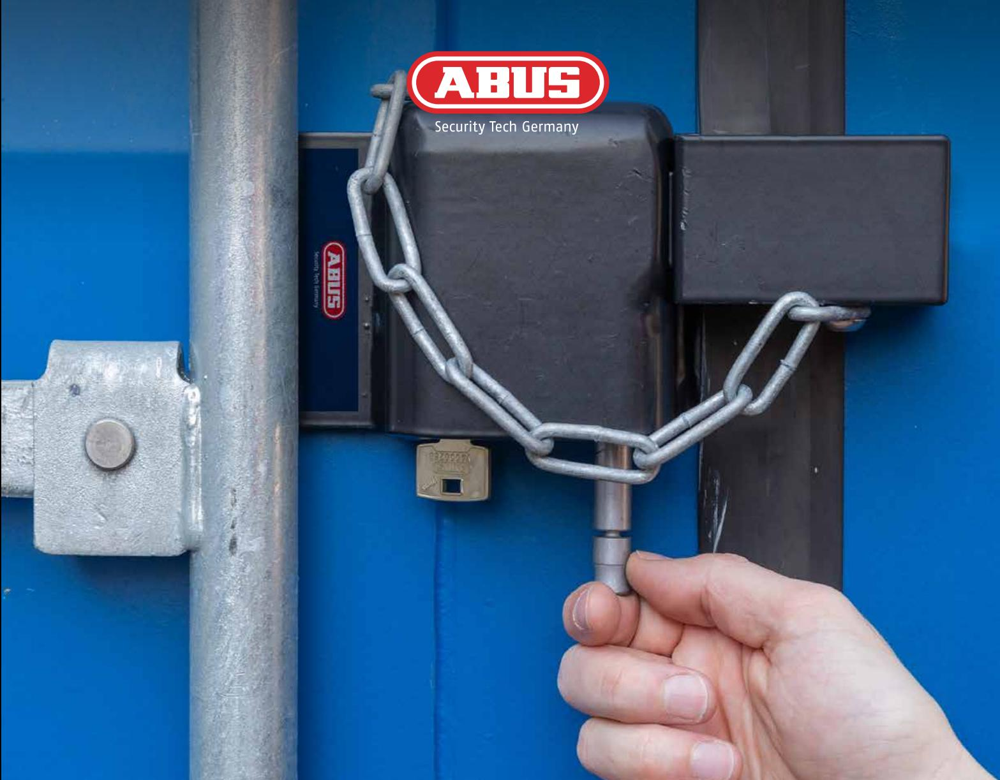
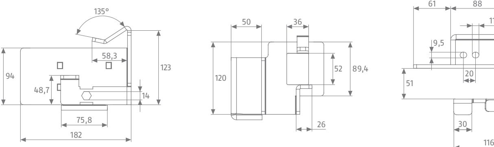

# CONHASP 230 ÖK AD CONTAINERSÄKERHET

Allt mer handelsvaror blir transporterade och lagrade i containrar. Dessutom förvaras material och maskiner i mängder av containrar på byggarbetsplatser. Oftast är de obevakade, lätta att bryta sig in i och alltså väldigt osäkra. Kriminella och inbrottstjuvar bryter snabbt upp såna containrar med enkla medel för att stjäla eller förstöra varor, byggmaterial och maskiner. Containerlåset ConHasp 230/100 från ABUS ger tillförlitligt skydd mot olagliga intrång med extra säkring av dörrarna, containerns svagaste punkt.

**abus.com**

# EN INNOVATIV NYHET FÖR LÅSNING AV CONTAINER

# **Användning och tillämpning**

- För låsning av container
- Passar vanliga transport- & lagercontainrar
- Containerlåset är av extremt tåligt stål
- Inbyggt monoblock och 10/30-halvcylinder av Europa-profil
- Alla delar är korrosionsskyddade
- Går att montera och demontera enkelt utan att lämna spår på objektet. Inga verktyg behövs.
- Uppfyller klass 5-kraven enligt SSF 1051 (Svenska Stöldskyddsföreningen)
- Vikt: 8,5 kg

11

50

19

## **Högsta kvalitet till bra pris**

| Artikelbeteckning                     | Artikelnummer |  |
|---------------------------------------|---------------|--|
| ConHasp 230/100 med 10/30 Vitess 4000 | 83452 3       |  |
| ConHasp 230/100 utan cylinder         | 87566 3       |  |

### **Antal nycklar**

3 nycklar inkl. säkerhetskort

### Kontakt:

ABUS | Gruppen Nordic A/S Egeskovvej 15A DK-8700 Horsens E-mail: sales@abus-nordic.com Tel. +45 70 20 29 05 (DK) Tel. +46 (0)36 36 14 88 (SE)

#### Adress eller företagsstämpel:

Rätten till tekniska och färgmässiga ändringar förbehålles. Vi tar inget ansvar för misstag och tryckfel. © ABUS 08/2019