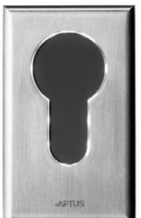

|            | SPECIFIKATIONER | Öppna 1100                           |
|------------|-----------------|--------------------------------------|
|            | Korttyp         | APC, APT och Aptusnyckel             |
|            | Mått (hxbxd)    | 116x70x20 mm                         |
| 90-670-110 | Drivspänning    | 12 V DC, levereras av centralenheten |
|            | Nettovikt i kg  | 0,3                                  |
|            |                 |                                      |

## **Öppn a 1100 Beröringsfri läs are**

## **EGENSKAPER OCH FÖRDELAR**

- -Tillverkad av rostfritt stål.
- -Belyst nyckelhålssymbol.
- -Utanpåliggande montage.
- -Kan beställas med inverterad logotyp.
- -Läser beröringsfria kort och nycklar.
- -Inbyggd summer.
- -Inbyggd sabotagekontakt.
- -Motståndskraftig mot sabotage.
- -För inom- och utomhusbruk.
- -Integrerbar med andra Multiaccess-produkter.
- - Kommunikation mellan centralenhet och läsare sker krypterat med 32-bitars nycklar.

| 12, levereras av centralenheten |                                                                    |
|---------------------------------|--------------------------------------------------------------------|
| min 0,36 max 1,56               |                                                                    |
| min 0,03 max 0,13               |                                                                    |
|                                 |                                                                    |
|                                 |                                                                    |
|                                 |                                                                    |
| Ja                              |                                                                    |
|                                 |                                                                    |
|                                 |                                                                    |
|                                 |                                                                    |
|                                 |                                                                    |
| 0,3                             |                                                                    |
|                                 |                                                                    |
|                                 | Öppna 1100 -30 till +60 10 till 100 Ja 116 70 20 |

## **www.aptus.se**

Aptus Elektronik AB - Ekonomivägen 3-5, 436 33 Askim telefon **växel:** 031 68 97 00 **försäljning:** 031 68 97 10 **fax:** 031 68 97 99 aptus@aptus.se **www.aptus.se**