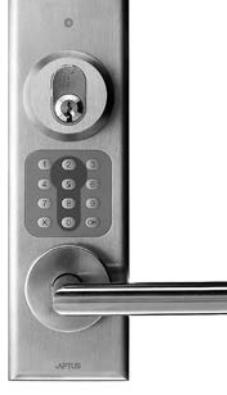
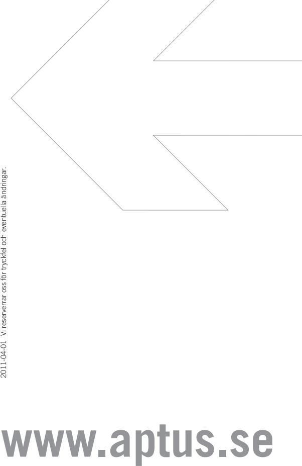

| SPECIFIKATIONER   | Öppna 1522                      |
|-------------------|---------------------------------|
| Korttyp           | APC, APT och Aptusnyckel        |
| Mått mm (hxbxd)   | 242x72x12                       |
| Drivspänning V DC | 12, levereras av centralenheten |
| Nettovikt i kg    | 0,3                             |
|                   |                                 |

## **Öppna 1522 Beröringsfri Läsare med knappsats**

**EGENSKAPER OCH FÖRDELAR**

- Tillverkad av rostfritt stål.
- Avsedd för montage på dörrblad med låscylinder.
- Läsare med knappsats avsedd för montering direkt på dörren.
- Läser beröringsfria kort eller nycklar.
- Inbyggd summer.
- För inom- och utomhusbruk.
- Är fullt integrerbar med andra Multiaccess-produkter.
- Kommunikation mellan centralenhet och läsare sker krypterat med 32 bitars nycklar.

| ELEKTRISK ANSLUTNING                    | Öppna 1522                      |
|-----------------------------------------|---------------------------------|
| Strömförsörjning V DC                   | 12, levereras av centralenheten |
| Förbrukning Watt                        | max 0,60                        |
| Amp                                     | max 0,05                        |
| OMGIVNING                               |                                 |
| Temperatur ˚C                           | -30 till +60                    |
| Luftfuktighet %                         | 10 till 100                     |
| ANSLUTNING TILL CENTRALENHET            |                                 |
| Centralenheter med programmering via PC |                                 |
| 700XX                                   | Ja                              |
| MC1                                     | Ja                              |
| MÅTT I MM                               |                                 |
| Höjd                                    | 242                             |
| Bredd                                   | 72                              |
| Djup                                    | 12                              |
| Nettovikt i kg                          | 0,3                             |
|                                         |                                 |

Aptus Elektronik AB . Ekonomivägen 3-5, 436 33 Askim . telefon **växel:** 031 68 97 00 **försäljning:** 031 68 97 10 **fax:** 031 68 97 99 aptus@aptus.se . www.aptus.se

## **PASSAGE**