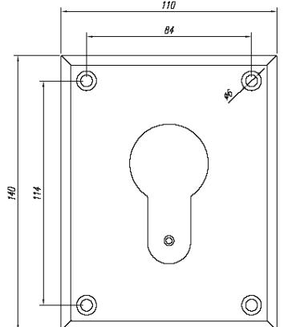
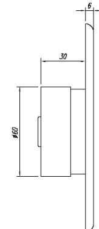
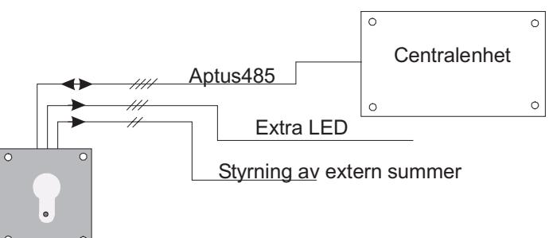
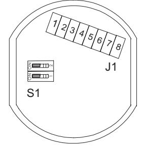

# **ÖPPNA 0110**

### **INSTALLATIONSANVISNING**

**Revision 3**

## **INSTALLATION 2**

#### **ALLMÄNT**

Läsaren används tillsammans med någon av våra centralenheter för att få ett komplett låsöppnings- och/eller larmförbikopplingssystem. Obs! 485 kommunikation till centralenhet, (Aptus485-buss).

#### **TEKNISKA DATA**

|                 | Strömförsörjning: 12 V DC reglerad (10.5 - 14). |  |
|-----------------|-------------------------------------------------|--|
|                 | Max 65mA, Min 30mA.                             |  |
|                 | Matning från centralenheten.                    |  |
| Utgångar:       | 2 för extra LED (interna lysdioden)             |  |
|                 | 1 för styrning av extern summer                 |  |
|                 | (belastas med max 0.5A)                         |  |
| Miljökrav:      | -30 till +60 grader Celcius                     |  |
|                 | 10 till 100% luftfuktighet                      |  |
| Mått:           | 110x140x38 mm                                   |  |
| Vikt: 0.25Kg |                                                 |  |

#### **PACKLISTA**

- 1 st Öppna 0110, Kortläsare
- 1 st Installationsanvisning (denna)
- 4 st Monteringsskruvar med plugg

#### **SYSTEMBESKRIVNING**

#### **MONTERING**

Enheten kan med fördel monteras i en standard eldosa. Vid montage direkt i betong, tegel, trä eller liknande bör håldiametern vara 70 mm för delen som fälls in i väggen.

#### **INKOPPLINGSANVISNING**

Använd partvinnad kabel t.ex. ELLXB-kabel 2x2x0.5 för anslutning till centralenhet.

Förlägg ett par till 485 (A+B) och spänning(12V+GND) i det andra paret.

Överstiger kabellängden 50 meter bör kabelarean vara minst 0.5mm2 för spänningsmatningen.

Du kan även använda Aptuskabeln som är framtagen för detta ändamål. Den är en 2-pars kabel med grövre area i ena paret: 2x0.15mm2 + 2x1.0mm2.

Tillse att Aptus485 bussen inte överstiger 200 meter.

Se till att signalkabeln är cirka 20 cm längre än vad som krävs. Detta för att man skall kunna ta isär enheten vid behov.

| J1:1 | B                              |  |
|------|--------------------------------|--|
| J1:2 | A                              |  |
| J1:3 | GND                            |  |
| J1:4 | 12V                            |  |
|      |                                |  |
| J1:5 | Extern LED, Röd                |  |
| J1:6 | Extern LED, GND                |  |
| J1:7 | Extern LED, Grön               |  |
| J1:8 | Summerstyrning *               |  |
|      | S1:on,on Terminering, Aptus485 |  |

* Vid styrning av extern

12 V-summer ansluts

+12V(J1:4) direkt till den

externa summern och summerstyrningsutgången (J1:8) till GND på den externa summern.

#### **LYSDIODER**

Läsaren har en flerfärgsled som kan blinka eller lysa i färgerna rött, grönt och gult. Signalerna som styr lysdioden finns även tillgänglig i J1:5,6,7 om externa lysdioder skall användas.

#### **INSTÄLLNINGAR**

| S1:1-2 | terminering | ON,ON => Terminering inkopplad.   |  |  |
|--------|-------------|-----------------------------------|--|--|
|        |             | Endast ändpunkterna av bussen ter |  |  |
|        |             | mineras.                          |  |  |

#### **SYSTEMKRAV**

MultiAccess från version 7.0. MC 1 från version A0 eller AC 700 från version N0.

#### **PROGRAMMERING**

När Öppna 0110 är inkopplad kan du få in den i MultiAccess genom att hämta hårdvara. En ny enhet med namnet "Öppna" skall komma upp. Under denna finns de resurser som hör ihop med denna läsartyp. På resursen "läsare" skall du ange vilken dörr som läsaren används till.

Avsluta programmeringen med att sända data.

#### **AVPROVNING**

Kontrollera en extra gång att alla signalledare är rätt inkopplade innan anläggningen spänningssätts.

#### **GARANTI**

Aptus Elektronik AB lämnar två års garanti på material och fabrikationsfel på samtliga produkter. Övrigt enligt leveransbestämmelser NL01.

#### **SERVICE**

För service hänvisar APTUS Elektronik AB till ansvarig återförsäljare som utöver egen kompetens har kontinuerlig kontakt med APTUS Elektronik AB.