# **DATABLAD OCH INSTALLATIONSMANUAL AD 800-AM**

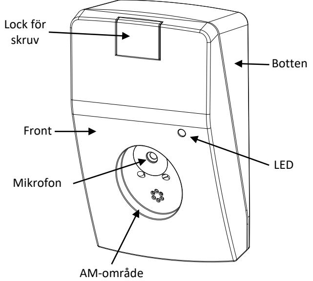

# **BESKRIVNING**

AD 800-AM är en akustisk glaskross detektor som ger larm när glas krossas vid ett inbrotts försök på t ex fönster, dörrar med glas samt glaspartier. AD 800-AM är utrustad med AM funktion med ett separat relä som ger larm vid sabotage av mikrofon och övertäckning. Detektorn är baserad på avancerad mikroprocessorteknik och är programmerad för att ta hänsyn till en mängd olika faktorer I rummets akustik DRC (Digital Room Compensation). Detta gör det möjligt för detektorn att skilja äkta glaskross från andra ljud och störningar. Detektorn är avsedd för inomhusbruk. Detekteringsavståndet är 1-9 meter. Detekteringsvinkel är 165 grader, vilket betyder att en detektor kan skydda flera glasytor I samma rum. Detektorn kan monteras i taket eller på en vägg med "fri" sikt mot glaset som skall skyddas. Notera att det är viktigt vid en årlig revision av anläggningen att kontrollera att detektorn har "fri" sikt.

**AD 800-AM testad av VdS enligt EN 50131-2-7-1:2012, Grad 3. Den är certifierad av SBSC, F&P, FG, VdS, INCERT m.fl.** 

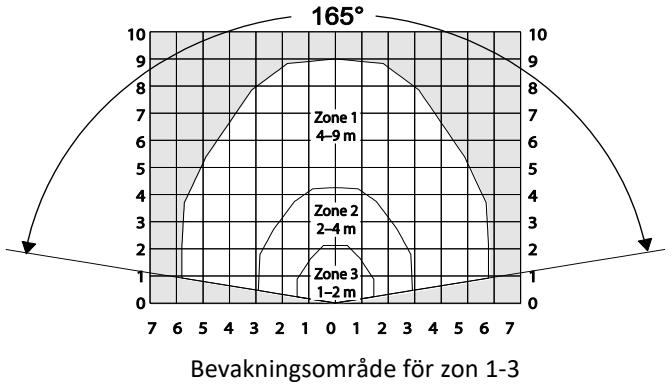

#### **ANSLUTNING TILL EN 24-TIMMARS SEKTION**

Detektorn är konstruerad för kontinuerlig övervakning och har gjorts extra tålig mot akustiska störningar av olika slag. Den fungerar väl i de flesta miljöer. I sällsynta fall kan en kombination av höga slumpmässiga ljud utlösa larm. I mycket bullerstörda lokaler som t ex gym eller fabrikslokaler, rekommenderar vi att detektorn testats 3-4 veckor innan man tar beslut om att använda den för kontinuerlig bevakning.

# **FÖRKLARINGAR AV RELÄ FUNKTIONERNA**

Detektorn har två reläer och en mikroswitch som ger information till centralapparaten i prioriterad ordning enligt följande;

- Glaskross; LARM relä öppnar
- Låg spänning, självtest fel; FEL-relä öppnar
- Maskning (AM); LARM och FEL-relä öppnar
- SABOTAGE aktiveras av öppningskontakten

|                        | Signal från relä eller micro-switch |         |          |  |
|------------------------|-------------------------------------|---------|----------|--|
| Händelser              | LARMRELÄ                            | FELRELÄ | SABOTAGE |  |
| Ingen aktivering       | Sluten                              | Sluten  | Sluten   |  |
| Inbrott                | Öppen                               | Sluten  | Sluten   |  |
| Masking (AM)           | Öppen                               | Öppen   | Sluten   |  |
| Låg spänning           | Sluten                              | Öppen   | Sluten   |  |
| Självtest av detektorn | Sluten                              | Öppen   | Sluten   |  |
| Sabotage               | Sluten                              | Sluten  | Öppen    |  |

# **ANVÄNDNING AV TESTAREN ADT 700**

I de flesta lugna rum/utrymmen som t ex kontor, behöver man inte använda testaren och detektorn kan vara inställd på zon 1. I rum/utrymmen med komplicerad akustisk rekommenderar vi användning av ADT 700 testaren. Vid årliga revisioner är ADT 700 mycket användbar då man kan fjärrstyra reläfunktionen och kontrollera inställningen utan att öppna detektorn.

# **ÖPPNA UPP DETEKTORN**

- Skjut locket uppåt
Lyft ut fronten

Lossa skruven 

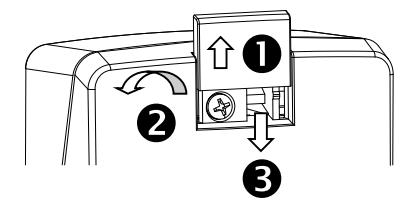

# **MONTERINGS ANVISNING**

Detektorn skall monteras på vägg eller i tak och riktad mot glaset som skall bevakas.

- Fri sikt mellan detektorn och glaset som skall bevakas är helt nödvändigt för en bra funktion
- Avståndet mellan glaset och detektorn skall vara 1-9 m
- Detektorn skall monteras minst 50 cm från ett hörn
- Detektorn skall monteras minst 1 m över golvet
- Detektorn skall monteras minst 30 cm från taket (vid montering på vägg)
- Detektorn skall monteras på plant underlag, som är fritt från föremål i en radie av 50 cm från detektorn
- Detektorn skall inte monteras I närheten av ventilation eller stora ljudreflekterande föremål
- Montera aldrig detektorn i hörn

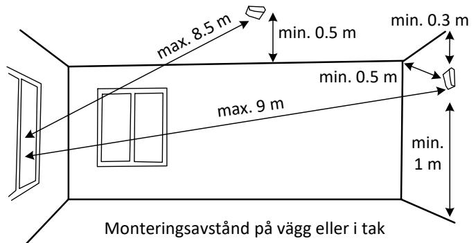

# **DETEKTEKTORBOTTEN EFTER BORTTAGANDET AV FRONT**

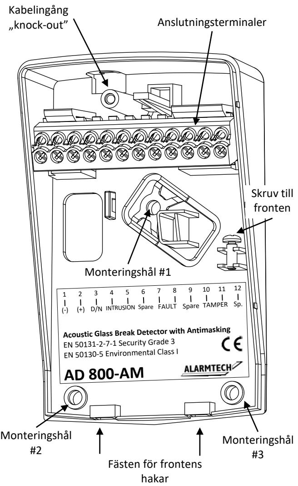

#### **INSTALLATION**

- 1. Välj ut den bästa platsen för montering på vägg eller i tak. the cover hooks
- 2. Lossa frontskruven och avlägsna fronten
- 3. Använd bakstycket som borrmall och markera ut hålen med en penna
- 4. Använd en 2.5 mm borr för medföljande skruvar eller annan lämplig skruv och plugg
- 5. Om så behövs slå ut kabelingången med lämpligt verktyg
- 6. Dra in kabeln genom hålet i sockeln
- 7. Anslut kablarna till skruvterminalerna

| Pin | Märkning  | Funktion                     |
|-----|-----------|------------------------------|
| 1   | (-)       | Minus                        |
| 2   | (+)       | Plus 7V till 30 V DC         |
| 3   | D/N       | Dag och Natt kontroll av LED |
| 4   | INTRUSION | Larmreläutgång C             |
| 5   | INTRUSION | Larmreläutgång NC            |
| 6   | Spare     | Ledig (fri kontakt)          |
| 7   | FAULT     | Felreläutgång C              |
| 8   | FAULT     | FEL reläutgång NC            |
| 9   | Spare     | Ledig (fri kontakt)          |
| 10  | TAMPER    | Sabotagekontakt C            |
| 11  | TAMPER    | Sabotagekontakt NC           |
| 12  | Spare     | Ledig (fri kontakt)          |

- 8. Använd medföljande kabelstrap för att fixera/avlasta anslutningskabeln I detektorn.
- 9. Montera varsamt detektor fronten I sockeln och skruva fast fronten med medföljande skruv.

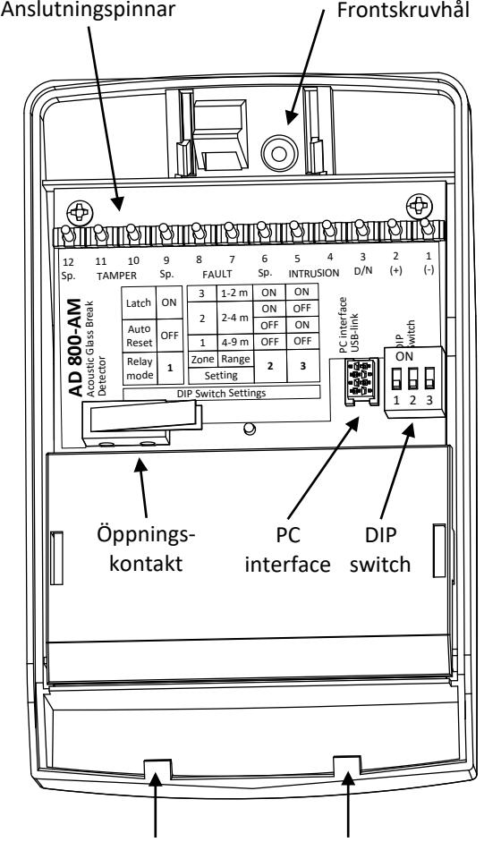

Hakar för fixering av front mot sockel

# **INSTÄLLNING AV DIP- SWITCHEN**

|                      | ON          | Avstånds- in |
|----------------------|-------------|--------------|
| LARM-reläinställning |             | ställning    |
| (DIP1)               | 3 2 1 | (DIP2, DIP3) |

| # | Funktion             | Inställning             |        |     |        |
|---|----------------------|-------------------------|--------|-----|--------|
| 1 | LARM-reläinställning | ON = Latch OFF =Auto |        |     |        |
|   |                      | 4-9 m                   | 2-4 m  |     | 1-2 m  |
|   |                      | Zone1                   | Zone 2 |     | Zone 3 |
| 2 | Avståndsinställning  | OFF                     | OFF    | ON  | ON     |
| 3 | Avståndsinställning  | OFF                     | ON     | OFF | ON     |

DIP1=ON: Innebär att LARM-relä kommer att öppna vid larm och vara öppet tills återställning sker.

DIP1=OFF: Innebär att LARM-relä öppnar i ca 2 sekunder vid larm och därefter sluts.

- 10. Ställ in av önskat avstånd, genom att förändra detektorns känslighet, använd DIP switch nr. 2 and 3.
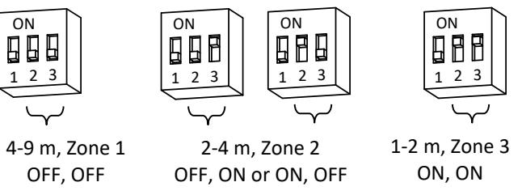

- 11. Kontrollera fönstrens konstruktion och typ av glas notera vilken typ av glass det är i det inre glaset.
# **REKOMMENDERADE INSTÄLLNINGAR AV DETEKTORN BEROENDE PÅ KONSTRUKTIONEN OCH TYP AV GLAS**

Kontrollera glasets konstruktion och vilken typ av glas i denna applikation speciellt viktigt är insidan av rummet.

- **Enkelglas** (planglas & härdat) Ställ in detektorn enligt uppmätt avstånd från glas till detektorn.
- **Dubbelglas** (planglas & härdat). Ställ in detektorn efter avståndet mellan fönster och detektorn vid hög ljudnivå (störningar) i omgivningen. Vid normal ljudnivå ställ in detektorn på zon 1* (4-9 m).
- **Dubbelglas** när det inre glaset är täckt av **säkerhetsfilm**. Ställ in detektorn på zon 1* (4-9 m) oavsett uppmätt avstånd till fönstret
- **Trippelglas** (planglas & härdar) ställ in detektorn på zon 1*(4- 9 m) oavsett uppmätt avstånd till fönstret.
- **Laminerat glas** ställ in detektorn på zon 1*(4-9 m) oavsett uppmätt avstånd till fönstret.

| Fönsterdesign |                                      | Typ av glas i den inre rutan                  |                 | Avstånd |       |       |  |
|---------------|--------------------------------------|-----------------------------------------------|-----------------|---------|-------|-------|--|
|               |                                      |                                               |                 | 1-2 m   | 2-4 m | 4-9 m |  |
|               | 1 Enkla glasrutor                    | Standard planglas och härdat glas             |                 | Zon 3   | Zon 2 | Zon 1 |  |
|               | 2 Dubbla glasrutor                   | Standard planglas och härdat glas          | Höga störningar | Zon 3   | Zon 2 | Zon 1 |  |
|               |                                      |                                               | Låga störningar |         | Zon 1 |       |  |
|               | 3 Treglasrutor                       | Standard planglas och härdat glas             |                 | Zon 1   |       |       |  |
|               | 4 Dubbla glasrutor med säkerhetsfilm | Standardglas med säkerhetsfilm på inre glaset |                 | Zon 1   |       |       |  |
|               | 5 Laminerat glas                     | Laminerat glas                                |                 | Zon 1   |       |       |  |

# **STÄNGA DETEKTORN**

- Sätt in lockets i bottens hållare för hakarna into slots in the base
- Stäng locket tills det klickar

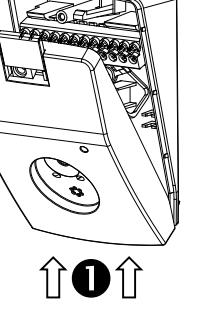

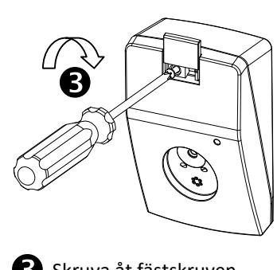

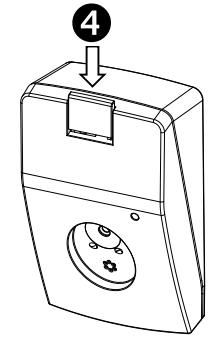

Skruva åt fästskruven

- screw Skjut över täcklocket
# **KONTROLLERA INSTÄLLNINGARNA MED ADT 700 TESTINSTRUMENT**

ADT 700 är ett testverktyg som tillverkas speciellt för att kalibrera och ställa in detektorn till bästa möjliga funktion. När testning av detektorns inställningar görs behöver man inte öppna detektorn för ADT 700 kommunicerar med detektorn via akustiska signaler. Utför aldrig testerna på AD 800-AM med locket av. Se till att lock och sockel är korrekt monterat.

**Varning!** Använd aldrig ADT 700 I omedelbar närhet av öron då testaren avger starka högfrekventa ljud. Skydda hörseln med hörselskydd.

Om detektorn är placerad för långt eller för nära glaset, kommer den inte reagera. Vid DRC testning kommer lysdioden på detektorn att blinka 1, 2 eller 3 gånger för att visa vilken Zon som är den bästa inställningen. Om den inte blinkar måste den placeras på ett bättre ställe.

- 1. Montera på locket och se till att krokarna fäster ordentligt i lockets hållare.
- 2. Slå på spänningen till detektorn, LED kommer nu att indikera den inställning som den har genom att 1-3 blinkningar.
- 3. Använd ADT 700 för att testa och kalibrera detektorn för bästa inställning. Se dess handhavandeinstruktion.

# **DIGITAL ROOM COMPENSATION PROCEDUREN**

Förbered den akustiska detektorn för DRC genom att ställa in D/N-ingången (om den används) i DAG-läge: D/N-linjen ska lämnas öppen eller låg.

- 1. Tryck på START-knappen på ADT 700-testaren för att sätta på strömmen. Grön LED lyser.
- 2. Håll testaren 1 till 3 m från detektorn och rikta högtalaren mot den.

- 3. Tryck en gång till på START-knappen för att starta DRCläget. Lysdioden på detektorn börjar blinka.
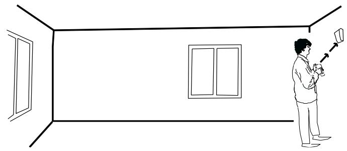

- 4. Gå till det längsta avståndet (max 9 m) från glaset som ska skyddas och rikta högtalaren mot detektorn.
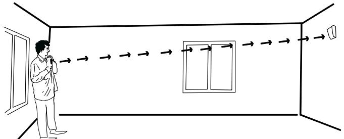

- 5. DRC-området beräknat av detektorn kommer att visas som ett antal pulser från 1 till 3.
Tryck på DRC-knappen för att skicka ut en DRC-signal. Gör detta 2-10 gånger från olika vinklar av skyddsområdet för att uppnå bästa effekt. Lysdioden blinkar och bekräftar att den har tagit emot signalen. Lysdioden börjar då blinka och flimra. DRC-området beräknat av detektorn kommer att visas som 1 till 3 blinkande pulser. Vid alltför svaga eller för starka signaler (innebär att detektorn placeras för nära eller

för långt ifrån objektet som ska skyddas) kommer detektorn då inte att visa DRC-området utan enbart snabba blinkningar.

- 6. Tryck på STOP-knappen från ett avstånd på 1 till 3 m från detektorn för att avsluta DRC-proceduren. Om DRC-området som mätts av detektorn skiljer sig från de faktiska inställningarna för DIP-omkopplaren, fortsätter lysdioden att blinka 1-3 gånger och visar det rätta intervallet
	- som ska ställas in i detektorn. • Lysdioden blinkar 1 gång: Ställ in till Zon 1 (4-9 m)
	- Lysdioden blinkar 2 gånger: Ställ in till Zone 2 (2-4 m)
	- Lysdioden blinkar 3 gånger: Ställ in till zon 3 (1-2 m)

# **SKYDD AV FLERA FÖNSTER MED SAMMA DETEKTOR**

Detektorn kan skydda flera fönster I samma rum om glasytorna ligger inom detektorns täckningsområde. Utför oberoende DRC test för varje fönster som skall skyddas. Följ proceduren som beskrivs ovan för varje fönster. Detektorn skall ställas in på **lägsta zon** som indikeras av detektorn.

### **TIMEOUT**

Både Detektorn och ADT 700 har tidsstyrda funktioner, som innebär att detektorn avbryter sin DRC inställning och att ADT 700 stängs av efter ca 3-4 minuter om ingen aktivitet sker.

#### **D/N KONTROLL (Day/Night)**

D/N gör det möjligt att fjärrkontrolera detektorernas larmindikering. Den kan också återställa detektorns relä och larmindikeringar samt se vilken detektor som först löst larm I ett antal sammankopplade detektorer. D/N ökar säkerheten genom att larmindikeringarna kan döljas utan att reläfunktionen påverkas.

#### **SJÄLVTEST**

Detektorn övervakar kontinuerligt samtliga kritiska komponenter som har avgörande betydelse för att detektering av glaskross skall fungera.

#### **ANTI-MASKING**

Test av AM-systemet: Slå på spänningen, vänta ca 1 minut. Täck över mikrofonen med plast eller dylikt. LARM- och FEL-reläet kommer att öppna efter max 180 s och indikera maskning av mikrofonen. Avlägsna materialet och reläerna återgår efter ca 1 minut.

#### FÖRKLARING AV LYSDIODENS (LED) FUNKTION NÄR DETEKTORN ÄR AKTIV

| LED                              | Detektorstatus                          |  |
|----------------------------------|-----------------------------------------|--|
| Blinkar 1-3 gånger               |                                         |  |
| när spänning                     | Visar känslighetsinställningen          |  |
| ansluts                          |                                         |  |
| Släckt                           | Normalt, inget larm                     |  |
|                                  | Larm detekterad, när detektorn är       |  |
| Ständigt lysande                 | Inställd för LATCH med DIP 1            |  |
| Lyser med 1 dipp var 3:e sek. | Maskering detekterad                    |  |
|                                  |                                         |  |
| var 3:e sek.                     |                                         |  |
| Kort blink                       | Antimask varning, främmande objekt nära |  |
|                                  | mikrofon                                |  |

# **FÖRKLARING AV LYSDIODENS(LED) FUNKTION NÄR DETEKTORN TESTAS MED ADT 700 OCH ÄR I KALIBRERINGSLÄGE**

| LED                            | Detektorstatus                   |
|--------------------------------|----------------------------------|
| Flimrar snabbt                 | testläge                         |
| Flimrar och blinkar            | kalibreringsläge                 |
| Blinkar 1.5 sek.               | Bekräftar mottagen signal        |
| Blinkar långsamt efter         | Ställ in känsligheten till Zon 1 |
| kalibrering 1 gg var 3:e sek.  | (4–9 m)                          |
| Blinkar långsamt efter         | Ställ in känsligheten till Zon 2 |
| kalibrering 2 ggr var 3:e sek. | (2–4 m)                          |
| Blinkar långsamt efter         | Ställ in känsligheten till Zon 3 |
| kalibrering 3 gg var 3:e sek.  | (1–2 m)                          |

# **FEL SÖKNING**

*Detektorn reagerar inte*

- Kontrollera spänning och polaritet
*LED lyser konstant*

- Slå ifrån detektorn en kort stund
- Kontrollera om LED står i latching läge (DIP1=ON) *LED lyser konstant med 1 dipp per 3 s*
- Kontrollera om mikrofonen är maskerad med främmande material
- *LED lyser konstant med 2 dippar per 3 s*
- Kontrollera matningsspänningen måste vara högre än 7 V *Löser inte larm*
- Kontrollera anslutningen till LARM- och FEL-relä
- Kontrollera larmslingan

#### **TEKNISKA DATA AD 800 AM**

| Typisk tjocklek av glass om skall skyddas | Planglas (4 mm), laminerat P2, P4 (4 mm + 4 mm)                       |
|-------------------------------------------|-----------------------------------------------------------------------|
| Glasstorlek                               | min 40 × 40 cm                                                        |
| Max avstånd                               | 9 m se avståndsdiagrammet                                             |
| Avståndsinställningar                     | Zone 1 = 4–9 m                                                        |
|                                           | Zone 2 = 2–4 m                                                        |
|                                           | Zone 3 = 1–2 m                                                        |
| Matningsspänning                          | 7 – 30 V, DC                                                          |
| Max. rippel                               | 2 Vpp vid 12 V , 4 Vpp vid 24 V                                       |
| Lågspänningslarm                          | Felsignal vid < 7 V                                                   |
| Strömförbrukning                          | 12 mA @ 12 V, 7.3 mA @ 24 V                                           |
| D/N signal nivå                           | DAY = D/N öppen eller < 2.5 V, NIGHT = D/N > 2.5 V                    |
| LARM-utgång, FEL-utgång                   | Relä, 50 mA, 50 V DC/peak AC, Rs ≤ 30 Ω                               |
| SABOTAGE-kontakt                          | 50 mA/50 V DC/peak AC                                                 |
| Indikering av Larm/FEL                    | LED                                                                   |
| Miljöklass EN 50130-5:2011, VdS 2110      | Class I                                                               |
| Arbetstemperatur                          | +5°C till +40°C                                                       |
| Luftfuktighet                             | max. 93% RH                                                           |
| Kapsling                                  | ABS plast, vit                                                        |
| Dimensioner [BxHxD]                       | 68 x 109 x 40 mm                                                      |
| Testad av VdS enligt följande standard    | EN 50131-2-7-1:2012/ A1:2013, Grade 3; SSF 1014-4; VdS 2332, Klasse B |
| Godkännande                               | EN: ST000238, VdS: G117504                                            |

© 2016 Alarmtech - www.alarmtech.se 4 / 4 AD800-AM manual nh1643a_se