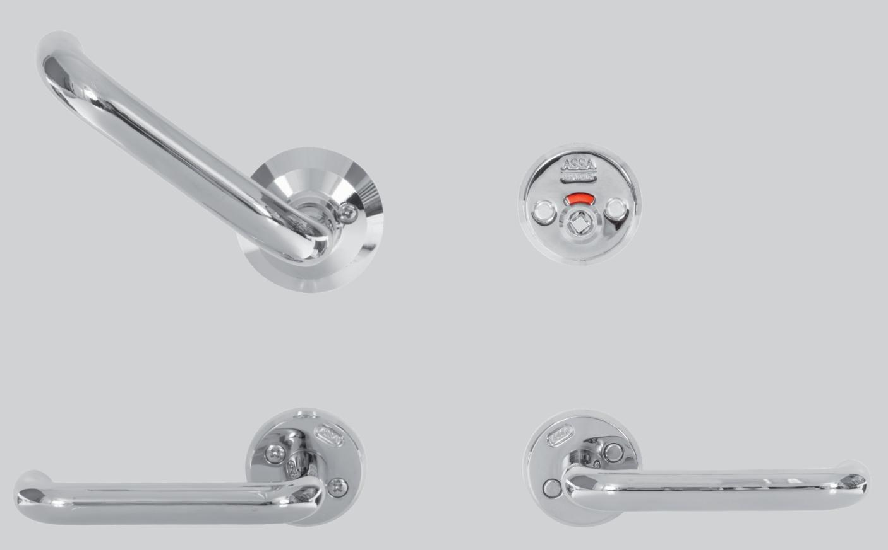
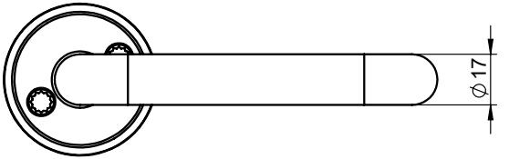

## 9566T2-TRYGG

### RWC-behör

### **Användningsområde**

För RWC-toaletter på skolor, institutioner och offentlig miljö

#### **Egenskaper**

- Material: Mässing
- Ytbehandling: PRION
- Passar låshus Connect 310-50 och Classic 565-50
- Trycke 6616 på in och utsida på tryckesroddaren
- Flip-Up trycke på insidans cylinderroddare
- Täckskylt med röd / vit indikering på utsidans cylinderroddare
- Öppningsbart från utsidan med paniknyckel 451283 (beställes separat)
- Klisterdekal insida dörr låst/olåst ingår
- Dörrtjocklek 38-60 mm
- Max C-mått = 40 mm
- Max C-mått med lång medbringare = 60 mm (beställes separat)

#### **Funktion**

- Låses eller öppnas från insidan genom att trycket förs uppåt eller nedåt "Flip-up"
- Möjlighet att från insidan med hjälp av nedre trycket känna om dörren är låst
- Röd / vit indikering från utsidan
- Öppningsbart från utsidan med paniknyckel 451283 (beställes separat)

#### **Artikelnummer**

| 9566T2 TRYGG höger   | 706811 101 001 |
|----------------------|----------------|
| 9566T2 TRYGG vänster | 706811 102 001 |

# 9566T2-TRYGG

(5.5)

## RWC-behör

52

5,5

52

ASSA ABLOY Opening Solutions Sweden P.O. Box 371 SE-631 05 Eskilstuna Sweden Phone +46 (0)16 17 70 00

Customer support: Phone intl. +46 (0)16 17 71 00 Phone nat. 0771-640 640 helpdesk.se.openingsolutions@assaabloy.com assaabloy.se

